# Calista Backend Architecture

## Overview

Calista is a stateless API backend that generates educational geography cards using an LLM. The backend receives a prompt, calls an LLM to produce structured JSON (country/region data, GeoJSON coordinates, color palettes), then optionally renders that data into SVG maps via a custom rendering engine called **calistaEG**.

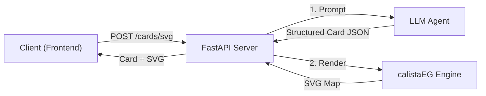

### Technology Stack

| Component | Technology |
|---|---|
| Language | Python 3.14 |
| Web Framework | FastAPI |
| ASGI Server | Uvicorn |
| LLM Agent | pydantic-ai |
| Data Validation | Pydantic |
| LLM Provider | Groq (qwen3.6-27b) |
| Package Manager | uv |

### Project Structure

```
src/
├── backend/
│   ├── main.py              # Entry point
│   ├── api/
│   │   └── routes.py        # HTTP endpoints
│   ├── agent/
│   │   ├── agent.py         # LLM agent logic
│   │   └── models.py        # Pydantic data models
│   └── calistaeg/
│       └── engine.py        # GeoJSON-to-SVG renderer
└── test/
    └── test.py              # Integration tests
```

---

## API Layer

### Endpoint Architecture

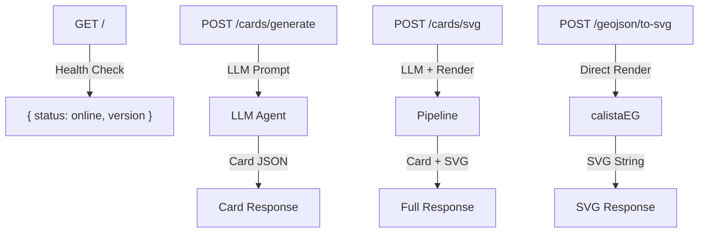

### Request/Response Models

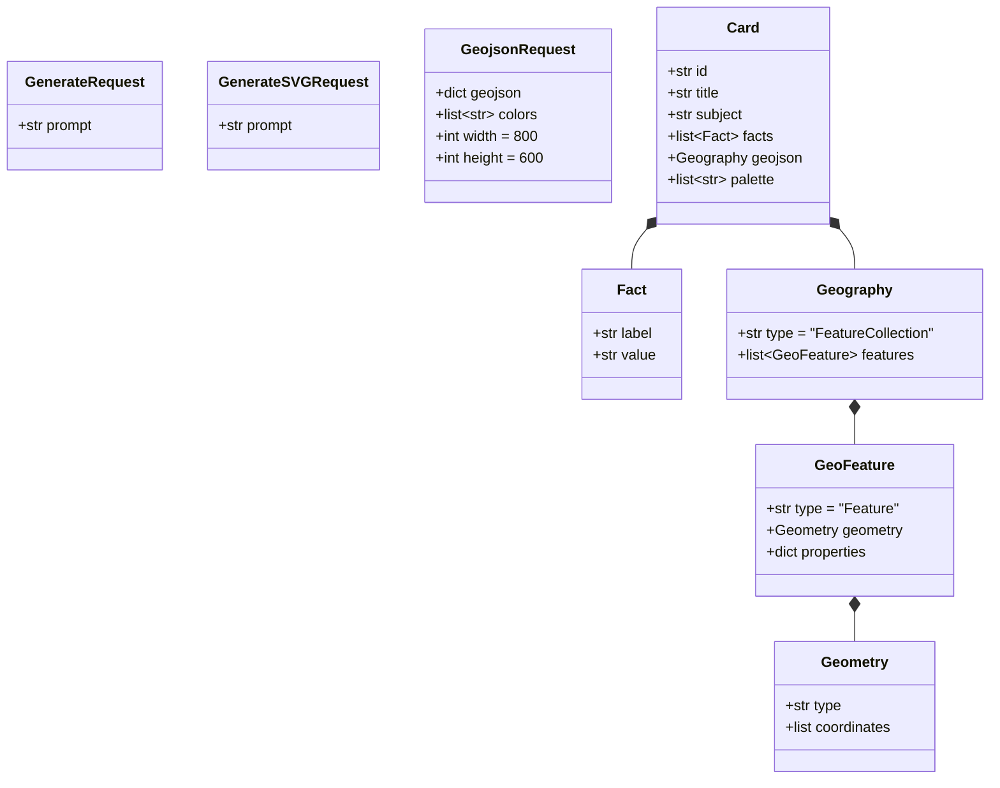

### Error Handling

All endpoints follow a consistent error pattern:

- **502 Bad Gateway** — LLM call failures (prompt processing, JSON parsing)
- **422 Unprocessable Entity** — Invalid GeoJSON input for rendering
- **200 OK** — Successful responses

---

## LLM Agent Service

### Agent Architecture

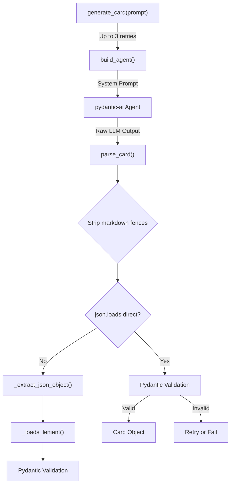

### Provider Selection

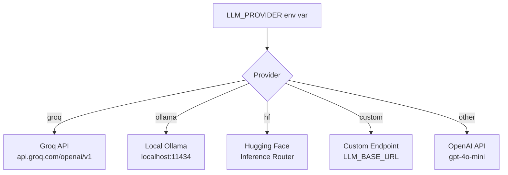

### JSON Parsing Pipeline

The agent uses a defensive 3-layer parsing strategy to handle imperfect LLM output:

1. **Direct parse** — Standard `json.loads()` on cleaned text
2. **Comma stripping** — Remove trailing commas before `}` or `]`
3. **Brace recovery** — Try appending combinations of `]` and `}` to fix unclosed structures

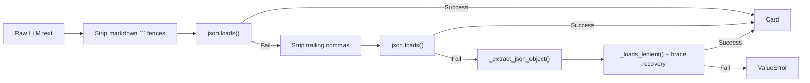

---

## calistaEG Rendering Engine

### Rendering Pipeline

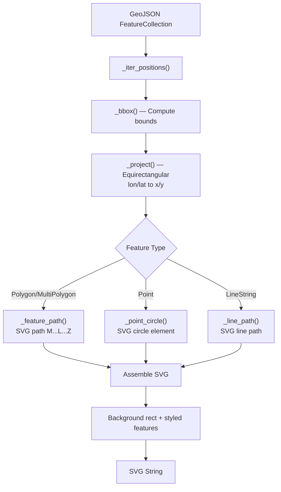

### Projection Details

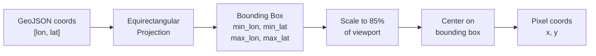

### Rendering Rules

| Feature Type | Fill | Stroke | Default Style |
|---|---|---|---|
| Polygon | Palette color | White 2px | Filled shape |
| Point | — | — | Red circle, r=6 |
| LineString | — | Palette color 3px | No fill |
| Background | Last palette color or `#eef4fa` | — | Full viewport rect |

---

## Data Models

### Core Domain Model

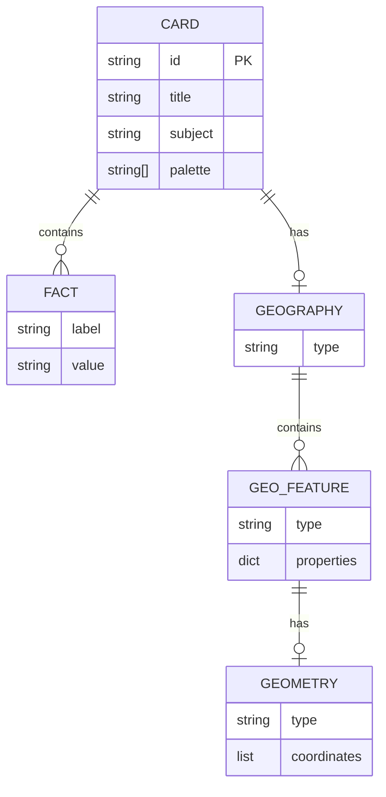

---

## Configuration & Environment

### Environment Variables

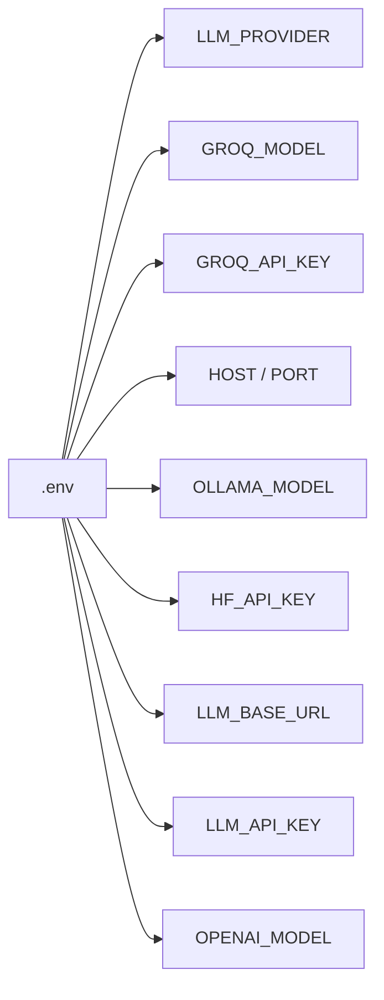

### Startup Flow

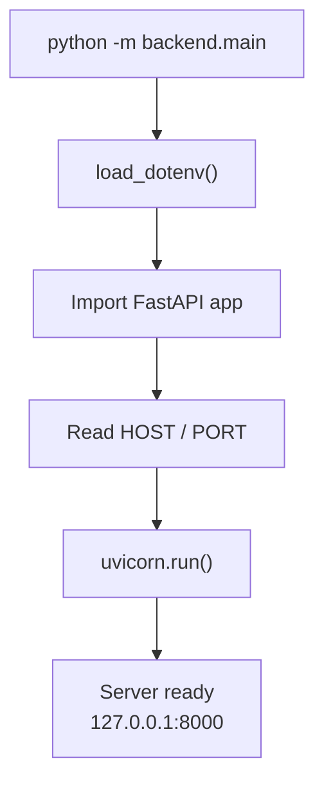
