# Architecture du Backend Calista

## Vue d'ensemble

Calista est un backend API stateless qui génère des cartes éducatives de géographie en utilisant un LLM. Le backend reçoit un prompt, appelle un LLM pour produire du JSON structuré (données de pays/région, coordonnées GeoJSON, palettes de couleurs), puis rendoptionnellement ces données en cartes SVG via un moteur de rendu personnalisé appelé **calistaEG**.

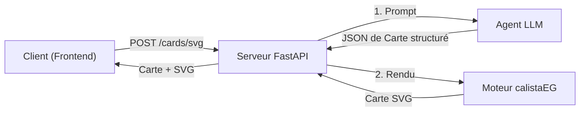

### Stack Technologique

| Composant | Technologie |
|---|---|
| Langage | Python 3.14 |
| Framework Web | FastAPI |
| Serveur ASGI | Uvicorn |
| Agent LLM | pydantic-ai |
| Validation de données | Pydantic |
| Fournisseur LLM | Groq (qwen3.6-27b) |
| Gestionnaire de paquets | uv |

### Structure du Projet

```
src/
├── backend/
│   ├── main.py              # Point d'entrée
│   ├── api/
│   │   └── routes.py        # Endpoints HTTP
│   ├── agent/
│   │   ├── agent.py         # Logique de l'agent LLM
│   │   └── models.py        # Modèles de données Pydantic
│   └── calistaeg/
│       └── engine.py        # Rendu GeoJSON-vers-SVG
└── test/
    └── test.py              # Tests d'intégration
```

---

## Couche API

### Architecture des Endpoints

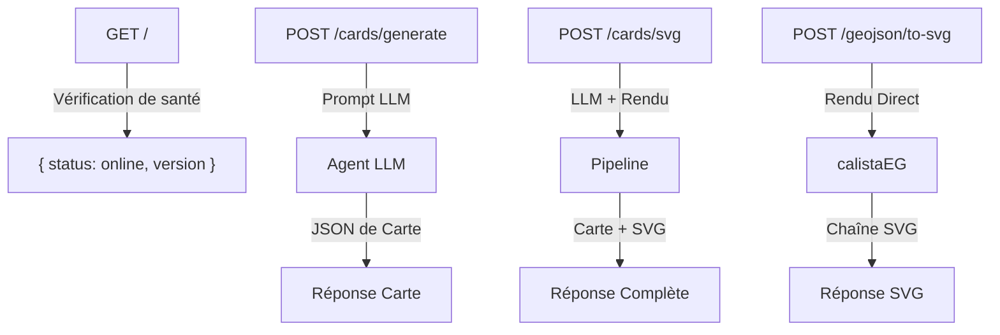

### Modèles de Requête/Réponse

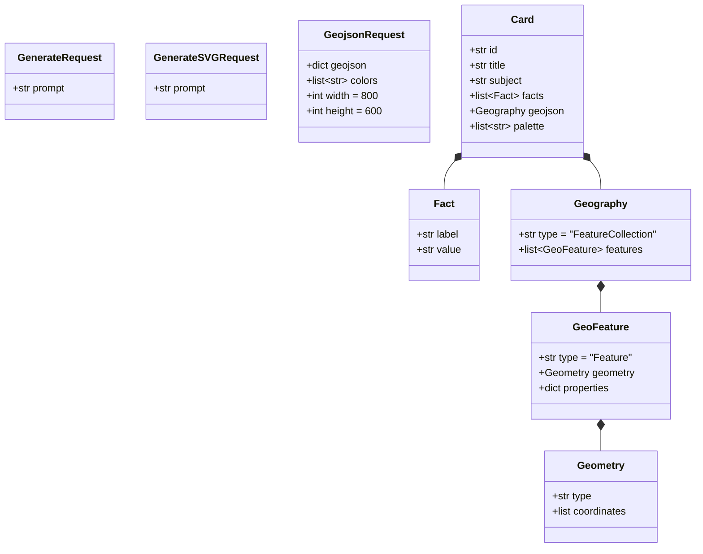

### Gestion des Erreurs

Tous les endpoints suivent un schéma d'erreur cohérent :

- **502 Passerelle incorrecte** — Échec d'appel LLM (traitement du prompt, parsing JSON)
- **422 Entité non traitable** — Entrée GeoJSON invalide pour le rendu
- **200 OK** — Réponses réussies

---

## Service Agent LLM

### Architecture de l'Agent

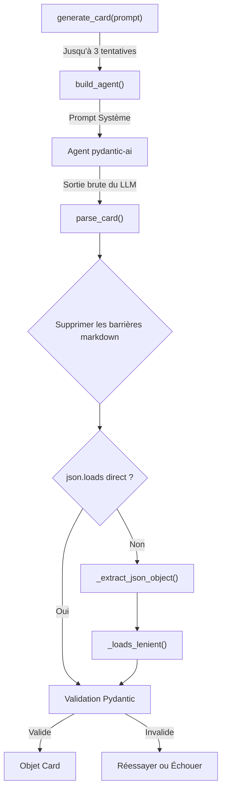

### Sélection du Fournisseur

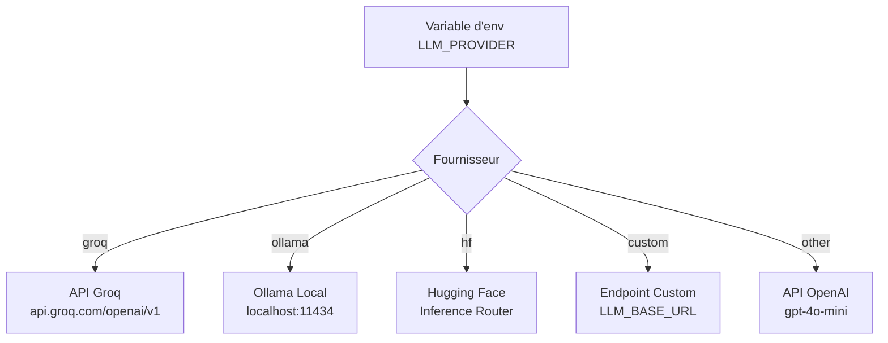

### Pipeline de Parsing JSON

L'agent utilise une stratégie de parsing défensive à 3 couches pour gérer les sorties imparfaites du LLM :

1. **Parsing direct** — `json.loads()` standard sur le texte nettoyé
2. **Suppression des virgules** — Retirer les virgules traînantes avant `}` ou `]`
3. **Récupération des accolades** — Essayer d'ajouter des combinaisons de `]` et `}` pour corriger les structures non fermées

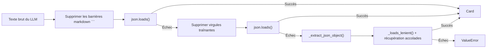

---

## Moteur de Rendu calistaEG

### Pipeline de Rendu

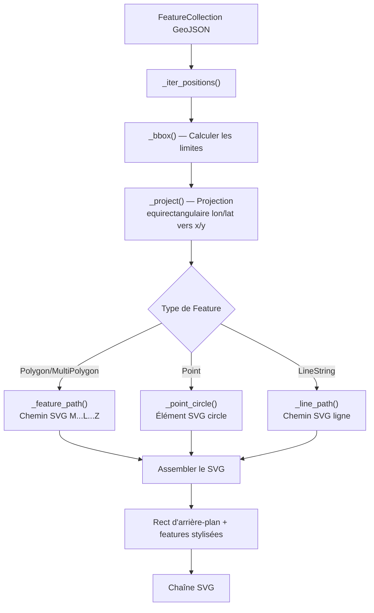

### Détails de la Projection

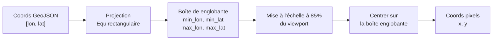

### Règles de Rendu

| Type de Feature | Remplissage | Contour | Style par défaut |
|---|---|---|---|
| Polygon | Couleur palette | Blanc 2px | Forme remplie |
| Point | — | — | Cercle rouge, r=6 |
| LineString | — | Couleur palette 3px | Pas de remplissage |
| Arrière-plan | Dernière couleur palette ou `#eef4fa` — | — | Rect du viewport complet |

---

## Modèles de Données

### Modèle de Domaine Principal

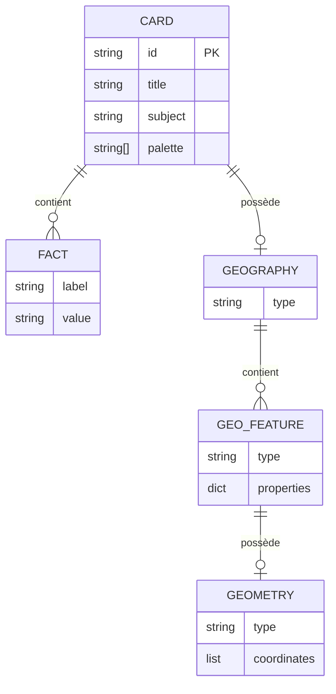

---

## Configuration & Environnement

### Variables d'Environnement

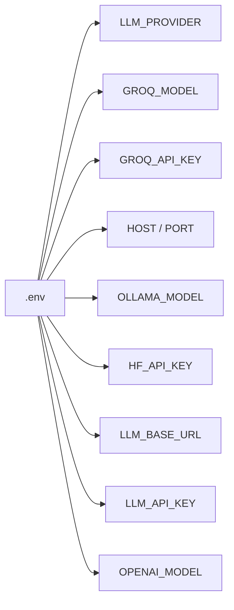

### Flux de Démarrage

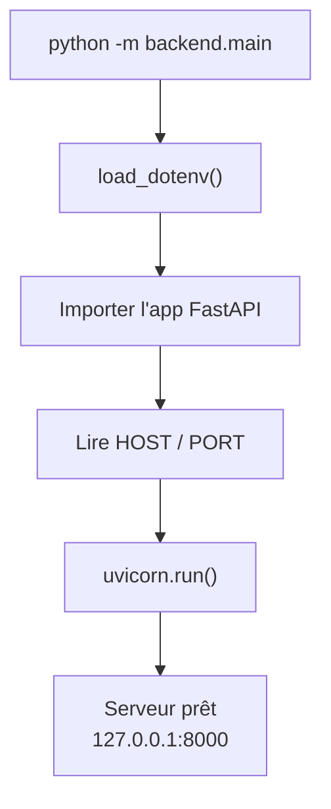
